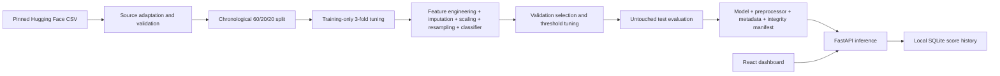

# Architecture and extension points

The application consists of the FastAPI service in `backend.main`, the React frontend, and the training pipeline in `src.train`. Saved evaluation candidates and rollback bundles are kept under `artifacts/real-data/`.

- **Single source of transformations:** inference invokes the saved imbalanced-learn pipeline. Sampling is skipped during predict; the saved standalone preprocessor is the same fitted transformation prefix.
- **Selection discipline:** the Hugging Face workflow uses a reproducible 60,000-row training sample for three expanding chronological CV windows; each finalist refits on all 629,145 training rows. Timestamps tied at boundaries remain together. XGBoost baseline and random-oversampling configurations are tuned by average precision; validation F2 selects the winner and threshold before later test evaluation. Validation/test data is never sampled or used for refitting. An optional minimum validation recall does not guarantee test recall. Earlier ULB experiments are archived under reports/ulb/ and are not comparable with this dataset.
- **Metadata-driven inputs:** JSON and CSV must match saved raw feature names exactly. All columns are required, individual nulls are imputed. Unseen categories use all-zero one-hot encodings. High-cardinality string columns require explicit engineering.
- **Input limits:** 64 KiB JSON, 5 MiB CSV, 10,000 batch rows. The ASGI middleware also bounds chunked uploads before multipart parsing.
- **Minimal history:** SQLite stores ID, timestamp, amount, score, model version, decision, threshold, risk and source. It does not store full input feature vectors. Counts are per active model, count repeated scoring calls as new analyses, and survive restarts.
- **Evaluation versus live:** frozen test charts and labeled examples are identified as benchmark data. Live flags have no ground-truth labels. Do not report their flag percentage as a measured fraud prevalence.
- **Serving topology:** a single API worker for the portfolio app; a non-root Nginx container serves Vite output and proxies /api. No separate queue or database service is required.
- **Model trust:** joblib executes pickle code. Only locally produced/operator-trusted bundles belong in models/. The SHA-256 manifest catches accidental corruption, not an attacker replacing both files and hashes. No endpoint accepts models or paths. Retrain after changing the pinned ML library environment.
- **Logging:** startup readiness and model version only; default access logs contain paths/status, not raw transactions.

## Later extensions

Introduce authentication and authorization at a gateway, HTTPS and request-rate limits before exposing real transaction data. Replace HistoryService with PostgreSQL for multi-user persistence; use Redis for caching and rate limiting. An artifact registry or MLflow can supply immutable version directories and signatures. A background job can compare temporal validation, label-delayed outcomes, calibration and drift. Kafka streaming, customer/merchant features, alerting and feedback need appropriate event-time controls and are intentionally outside this benchmark.
